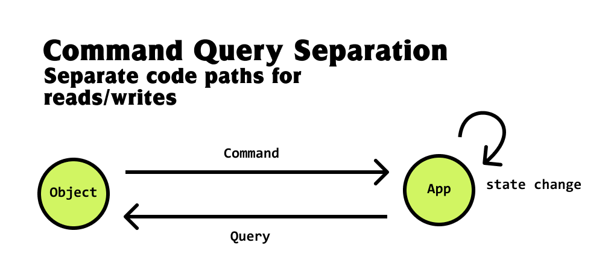
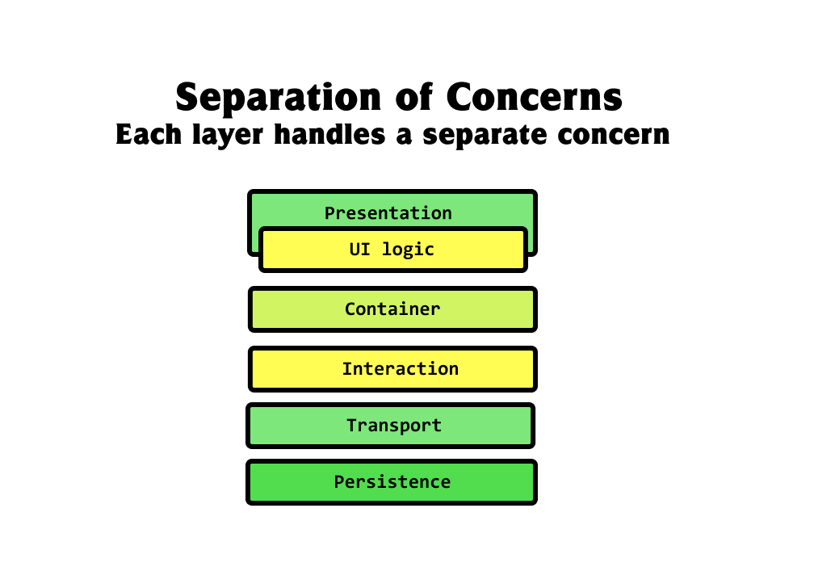

\***\*클라이언트 측 아키텍처 기본\*\***

[](https://khalilstemmler.com/articles/client-side-architecture/introduction/)[https://khalilstemmler.com/articles/client-side-architecture/introduction/](https://khalilstemmler.com/articles/client-side-architecture/introduction/)

리액트 애플리케이션의 아키텍처는 널리 인정되어 있는 표준이 없다. 매번 프로젝트를 시작하는 방법, 사용할 프레임워크, 상태 관리 방법, 번들로 제공되는 방법, 접근성 및 배포를 시작하는 방법까지 매번 선택해야 한다.

이 게시글은 이러한 고민에서 도움이 될 클라이언트 측 아키텍처 원칙을 소개한다.

## 아키텍처

### MVC, MVP 는 너무 일반적이다.

훌륭한 아키텍처지만 불행히 둘 다 너무 일반적인 문제를 겪는다.(generic 일반적?)

MVC와 MVP에서 모두 모델이 너무 많은 책임을 진다는 것이다. 결과적으로 개발자는 어떤 도구가 어떤 작업을 담당하는지 모르게 된다.

MVC와 MVP의 모델은 모호하다. 따라서 작업에 맞는 도구를 맞추는 것이 퍼즐처럼 느껴진다.

### 모델의 작업

- 상태관리
  - 대부분의 앱에는 상태를 가져오고, 업데이트하고, 변경될 때 뷰를 다시 렌더링 할 수 있도록 반응성을 구성할 방법이 필요하다.
- 네트워킹 및 데이터 가져오기
- 모델 동작 (도메인, 앱 또는 상호 작용 논리)
- 인증 및 권한 부여 논리

### 클린 아키텍처

- 테스트 가능하고 유연한 방식으로 백엔드를 구성하는 방법에 대해 많은 정보를 제공한다.
- 모델을 인프라, 애플리케이션, 도메인 레이어로 분할하여 관심사 분리 설계 원칙을 실행하고 아키텍처에 대해 훨씬 더 쉽게 추론할 수 있다.
- 이와 같은 계층 아키텍처는 단순한 단일 계측 아키텍처보다 복잡하지만, 많은 이점이 있다.
  - 스택의 어느 레이어에 어떤 도구가 필요한지 매우 명확하게 한다.
  - 문제를 분리하여 유지하고 앱 및 도메인 레이어 코드 단위를 테스트 가능하게 유지할 수 있다.
  - 테스트에 비용이 많이 드는 것을 모킹하고 라이브러리와 프레임워크를 교체할 수 있다.(필요한 경우에)

## 원칙

- 클라이언트에 클린 아키텍처를 그대로 따라할 필요는 없지만, 클린 아키텍처의 디자인 원칙과 관행을 보고 이를 클라이언트에 적용하는 것은 좋은 생각이라고 본다.
- 각 원칙은 어떤 식으로든 수행할 수 있는 작업과 작업 구성 방식에 대한 구조적 제약을 적용하는 것이다.

### 명령 쿼리 분리



- commands - 상태를 변경하지만 데이터를 반환하지 않음.

```tsx
function createUser (props: UserDetails): Promise<void> { ... }
function selectTodo (todoId: number): void { ... }
```

- queries - 데이터를 반환하지만 상태를 변경하지 않음

```tsx
function getCurrentUser (): Promise<User> { ... }
function getUserById (userId: UserId): Promise<User> { ... }
```

- 이 패턴의 주요 이점은 코드를 보다 쉽게 추론할 수 있다. 하나는 읽기용이고 하나는 쓰기용이다.

### 관심사 분리



- 클라이언트에서 위와 같이 관심사를 분리할 수 있다.

  

- 기능은 수직 슬라이스다.

  - 기능 = 모듈?

## 레이어


### Presentation Components

- 화면 구성요소는 UI 렌더링 및 사용자 이벤트를 생성한다.
- 화면 구성요소는 구현 세부사항이다.
- 화면 구성요소를 테스트할 때는 주로 UI 로직에 대해 테스트한다.

### UI Logic

- 어떤 상황에 어떤 화면을 보여줘야 하는지, 사용자 이벤트에 대한 호출 시기를 결정하는 조건등이 UI논리이다.
- UI 로직은 실제로 컴포넌트 내에서 테스트하려고 하는 것이다. (통합테스트)

### 컨테이너 / 컨트롤러

- 전통적으로 컨테이너 컴포넌트의 책임은 다음과 같다.
  - 사용자 이벤트를 소비하고 모델에 전달
  - 데이터 변경 사항을 구독하고 보기를 업데이트된 상태로 유지
- 반응형 모델에 연결하는 방법과 프레젠테이션 구성 요소에서 발생하는 이벤트를 처리하는 방법을 아는데 책임이 있다.

### 인터렉션 레이어

- 의사 결정 계층이다. api 요청을 할 때 백엔드로 통신하기 전 이 요청을 보낼지 결정할 수 있다.
- 클린아키텍처에서 애플리케이션 레이어로 보면 된다.
- 리액트 훅이 아닌 다른 방법으로도 모델을 구현할 수 있다. (xState, pojo-observer)
- 일반적으로 여러 레이어가 있다. (인증, 로깅, 구독, 렌더링 로직, 메타데이터 등)

### 네트워킹 및 데이터 가져오기

- 이 계층의 책임은 다음과 같다.
  - 백엔드 서비스의 위치 파악
  - 응답 공식화
  - 응답 데이터 또는 오류 마샬링
  - 비동기 상태 보고

### 상태 관리 및 저장

- 상태 관리 라이브러리에는 세가지 책임이 있다.
  - 저장소 - 일반적으로 저장소/클라이언트 측 캐시 어딘가에서 전역 상태를 유지한다.
  - 데이터 업데이트 중 - 캐시의 데이터를 변경한다.
  - 반응성 - 뷰 레이어 프레젠테이션 구성 요소가 데이터를 구독하고 데이터가 변경되면 다시 렌더링 할 수 있는 방법을 제공한다.

거의 2년전 게시글인데 리액트 쿼리 사용하는 현재 시점에선 위 아키텍처랑 비슷하게 개발하고 있는 것 같다. 애플리케이션 레이어에서 리액트 훅 없이 모델을 구현하는 방법이 궁금하다.
