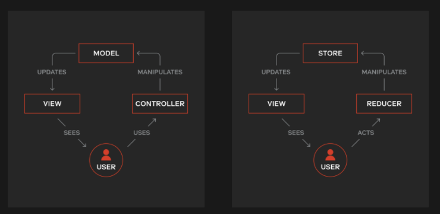

(내용 정리에 생각을 덧붙일 경우 `🤔` 이모지를 첨부합니다.)

## Development

---

### **[대세는 쿠버네티스 [Helm편] - 왜 Helm을 써야할까?](https://www.youtube.com/watch?v=m7iZtjeIHJw)**

- 앱, 환경마다 각각의 yaml파일을 만들다 보면 유지보수가 힘들다.
- 하나의 템플릿을 통해 yaml 파일을 동적으로 생성하게 해주는 도구가 헬름
- env, appName 과 같은 변수들을 동적으로 변경 가능
- 내 업무 환경별로 배포가 편하게 함
- 오픈소스를 편하게 설치

### [리액트 렌더링 최적화](https://www.youtube.com/watch?v=1YAWshEGU6g)

- 리액트에서 렌더링 === 함수를 호출하는 것
- 부모의 상태 변화로 자식에게 불필요한 리렌더링을 야기시킨다.
- 리렌더링의 조건 - state, props 변경
- 함수의 참조값을 유지하기 위해 useCallback 사용
- 리액트 렌더링 phase
  - render phase (재조정) → commit phase
    - 가상돔에서 변경사항 비교 후 실제돔에 적용하는 과정
  - useCallback을 써서 자식 컴포넌트의 props 참조값이 같다면 부모가 리렌더링 될 때 render phase는 실행되지만 commit phase으로 넘어가지 않는다.
- render phase조차 막으려면?
  - react memo 사용

### **[[10분 테코톡] 🧀 제리의 MVC 패턴](https://www.youtube.com/watch?v=ogaXW6KPc8I)**

- flow
  1. 사용자가 구글에 Coding이라고 검색 (Controller에 메시지 전달)
  2. 컨트롤러는 모델에 ‘Coding’에 대한 검색 결과 데이터를 요청
  3. 컨트롤러는 응답받은 데이터를 View에 전달
  4. View는 UI를 구성해 검색 결과 데이터를 사용자에게 노출
- 구성요소
  - 모델 : 데이터와 관련된 부분
  - 컨트롤러 : 모델과 뷰에 데이터를 제어함
  - 뷰 : 사용자에게 노출되는 부분
- MVC를 지키면서 코딩하는 방법
  1. 모델은 컨트롤러와 뷰에 의존하지 말아야 한다.
  2. 뷰는 모델에만 의존해야하며, 컨트롤러에는 의존하면 안된다.
  3. 뷰가 모델로부터 데이터를 받을 때는, 사용자마다 다르게 보여주어야 하는 데이터에 대해서만 받아야 한다. (스태틱한 정보들은 뷰에 캡슐화)
  4. 컨트롤러는 모델과 뷰에 의존해도 된다.
  5. 뷰가 모델로부터 데이터를 받을 때, 반드시 컨트롤러에서 받아야 한다.

### **[[10분 테코톡] 우디의 Flux Architecture](https://www.youtube.com/watch?v=wQFBgKl1PYw&t=47s)**

- Flux 왜 필요한가?
  - Flux란? 단방향 데이터 흐름을 통해 보다 예측가능하게 상태를 관리할 수 있는 클라이언트 사이드 웹 어플리케이션 아키텍처
  - 다익스트라, “프로그래밍의 예술은 복잡성을 조직화하고, 다수를 제어하며, 혼돈을 가능한 효과적으로 피하는 것이다.”
- MVC의 한계
  - 양방향 데이터 바인딩이 복잡성을 높인다. 양방향?
- MVC에서 Flux로 장점
  - 데이터 흐름의 구조화
  - 쉬운 유닛 테스트

### [react, redux, mvc 관련 블로그 포스팅](https://rangle.io/blog/how-react-and-redux-brought-back-mvc-and-everyone-loved-it/)

- mvc가 양방향 바인딩 때문에 복잡성을 높인다는 것이 이해가 안가서 찾아봄
  - 이 게시글은 리덕스 또한 mvc 패턴을 사용하고 있다고 함.

- MVC 패턴이나 리덕스나 데이터 흐름이 유사함.
  - 물론 Reducer가 Store를 직접 처리하는 더 많은 책임이 있음.
- MVC 패턴의 목적은 데이터와 사용자의 상호 작용을 구성하는 것이다.
  - 개발자가 처리해야 할 일반적인 문제인 관심사 분리 원칙에 직결된다.
  - 상태는 store가 갖고, 컴포넌트는 props로 데이터를 가져오기 때문에 컴포넌트의 책임은 데이터를 수신하고 렌더링만 처리하면 된다. 순수한 함수이므로 사이드이펙트가 없음.
- 리덕스를 사용하면 데이터 변경을 처리하는 모든 로직이 리듀서(컨트롤러)에 있을 것이다.
  - 이렇게 하면 구성 요소가 데이터상 오류가 발생했을 때 단일 지점에서 문제를 찾을 수 있기 때문에 추적하기 쉽다.
- 정리`🤔`
  - mvc나 flux나 사용자의 행동과 데이터를 처리하는 지점, 화면을 보여주는 영역을 나누려는 관심사 분리 차원에서의 의도는 동일한 것 같다.
  - A라는 액션이 발생했을 때 각각의 컴포넌트가 고유의 상태를 갖고 개별적으로 액션에 대한 상태 처리 로직을 가지는 대신 하나의 리듀서에서 모든 상태를 처리하는 것으로 데이터 흐름에 대한 출처를 파악하기 쉬운데에 의의가 있는 듯.

### **[[A4] Relay, 그리고 Declarative에 대해 다시 생각하기](https://www.youtube.com/watch?v=YP7d9ae_VzI)**

- 그래프QL, 릴레이를 사용해 전역 상태로 데이터 일관성 지키기
- 클라이언트 스키마 사용
  - 서버 레이어를 증가시키면, 네트워크 지연시간, 디버깅의 어려움 등 다양한 문제 발생
  - restapi 서버를 db개념으로 생각하고 그래프ql서버를 클라이언트에서 실행한다
- 적용하며 느낀점
  - 단점
    - 워크플로우가 복잡해짐
    - 타입 선언을 이중으로 해줘야 함
    - 번들사이즈 증가
  - 장점
    - 프래그먼트 코-로케이션을 통해 유지보수성이 높아짐
    - 데이터를 어떻게 처리하느냐 → 어떻게 선언하느냐
    - 컴파일 타임에 오류를 미리 알 수 있음
    - 데이터 관련한 버그가 현저히 줄어듬
- 선언적으로 작성한다는 것
  - How는 NPM 라이브러리처럼
    - 범용적으로 사용될 수 있도록 설계하기
    - 유닛 테스트를 촘촘하게
  - What은 따로 분리하지 않는 것을 제안
    - 어떤 컴포넌트인지, 어떤 의존성을 가지고 있는지 한 눈에 알 수 있도록
  - `🤔` 좋은 내용인데 내 생각에 해당 예시는 How가 아니라 When으로 느껴진다
    - 정확히는 When + (when을 어떻게 판단할지 - how) / what + (무엇을 어떻게 할지 - how)
    - When과 What의 기준으로 훅을 나누는 것도 자연스러움.

## ETC

---

### [하고 싶은 일을 끝까지 해내는 최고의 방법 - 셀프 넛징](https://bium.io/posts/self-nudging)

- 인간은 주어진 환경에 필사적으로 적응하고 그 환경에 알맞는 자신만의 컴포트존을 빠르게 수립한다.
- 의지의 힘은 약하다.
  - 우리는 ‘하고 싶은 일'이 무엇이었는지 계속해서 잊어버린다.
  - 해낼 수 밖에 없는 환경, 시스템을 만들자
- 넛지를 활용한 예시
  - 깰 때까지 꺼지지 않는 알람 앱
  - 모바일 게임 출석체크, 인센티브
